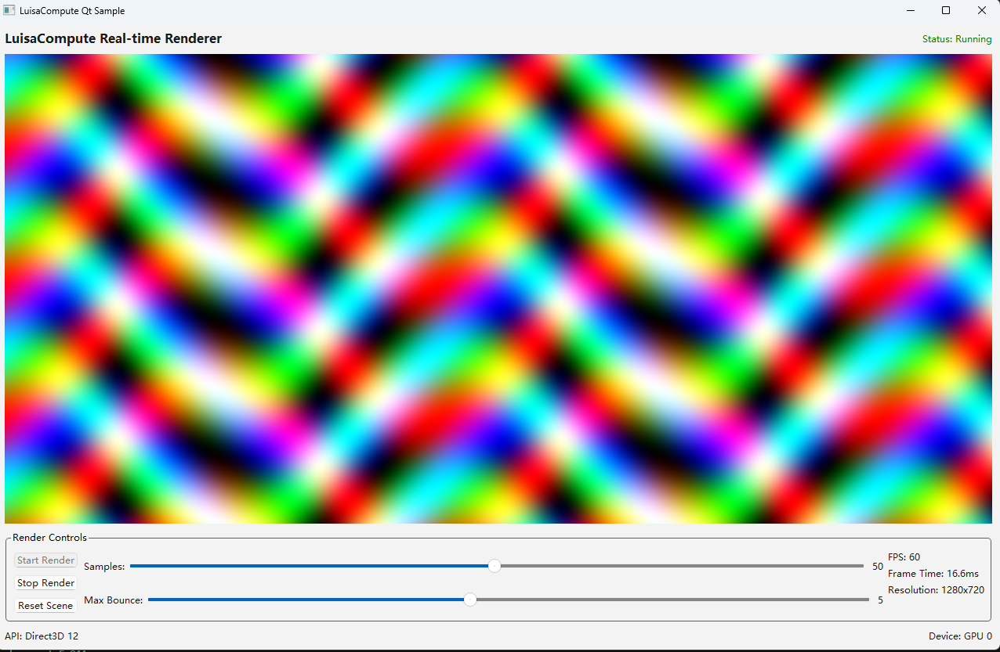

# LuisaCompute+Qt Sample

这是一个样例来展示如何使用LuisaCompute和Qt搭建比较复杂的桌面端样例

make sure Qt 6.6+ installed
edit .env.template -> .env with your LuisaCompute dir
`xmake l setup.lua`
`xmake`
`xmake run rhi_window_sample`

结果如图所示，UI组件只是为了展示，没有实际效果

